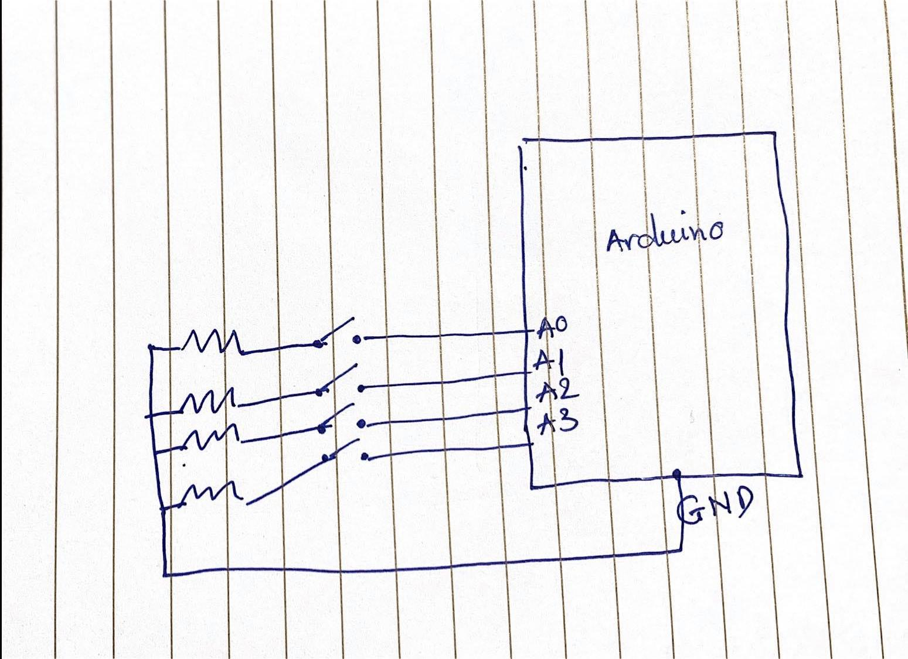

## Concepts:
Improving Space Ship Invasion (midterm project) by changing the interaction with game via physical button on Arduino instead of using the mouse like before

## Details:

### Input:
 - Yellow push button: Going left 
 - Red push button: Going right 
 - Blue push button: Shoot the bullet from teh spaceship
 - Green push button: Restart the game 
 
 ### Output:
- Motion on Processing 

## Media:

## Difficulties: 

- Understanding the speed of the ship because the computer redraw very fast 
- Communication between Arduino and Processing 
