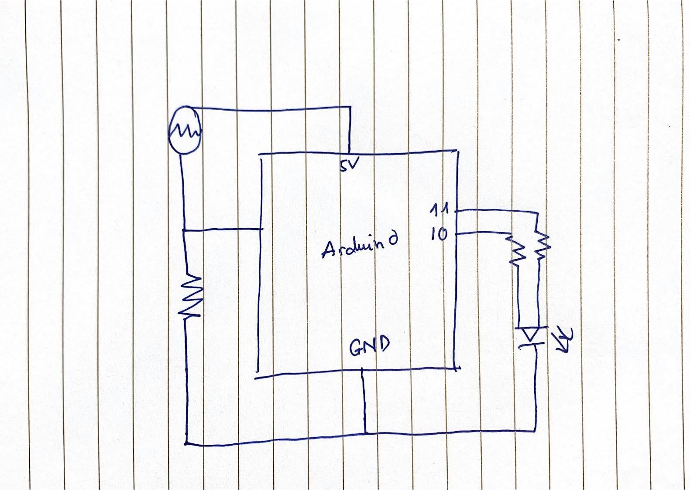

## Concepts: 
- LED changing color and brightness with photoresitor an potentiometer

## Difficulties: 
- The LED still cannot emmit the red HUE (I think it's because something is off with the RGB LED)

## Media: 

https://drive.google.com/file/d/1X1OvM2X2zlzSq5HtuJPO9urKw1u10Hyg/view?usp=sharing

 
