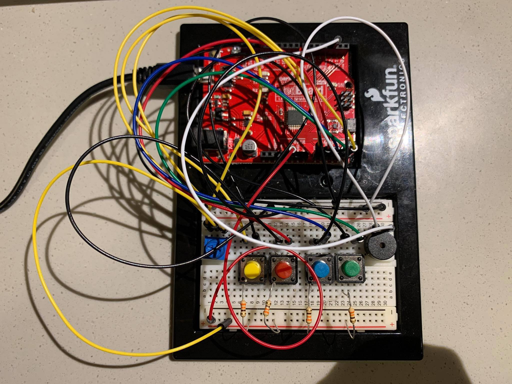

## Concepts:
My updated Musical Instrument is a real Piano with the total of 14 notes. Those are Do(c), Do#(c#), Re(d), Re#(d#), Mi(e), Mi(e#) = Fa(f), Fa#(f#), Sol(g), Sol#(g#), La(a), La#(a#), Si(b), Si# = Do(C)

## Details: 
My circuit contain 4 push buttons, 1 potentiometer, and 1 buzzer. 
I have organized the button direction suitable for the piano's hand position. 

### Input: 
- Button 1: Do 
- Button 1 & potentiometer: Do#
- Button 1 & 2: Re
- Button 1 & 2 & potentiometer: Re#
- Button 2: Mi 
- Button 2 & 3: Fa
- Button 2 & 3 & potentiometer: Fa#
- Button 3: Sol
- Button 3 & potentiometer: Sol#
- Button 3 & 4: La
- Button 3 & 4 & potentiometer: La
- Button 4: Si 
- Button Si & potentionmeter: Si# = Do 

## Media: 

## Dificulties:
One of the difficulties that I encountered is reading the potentiometer in order to make the black notes on the keyboard (Do#, Re#, ...) because 4 push buttons is not enough to create 14 notes. 

When you turn the potentiometer to one extreme, it did not reach the perfect 0 or 1023 so I had to do tests before assigning the value which my code will execute. 

 
