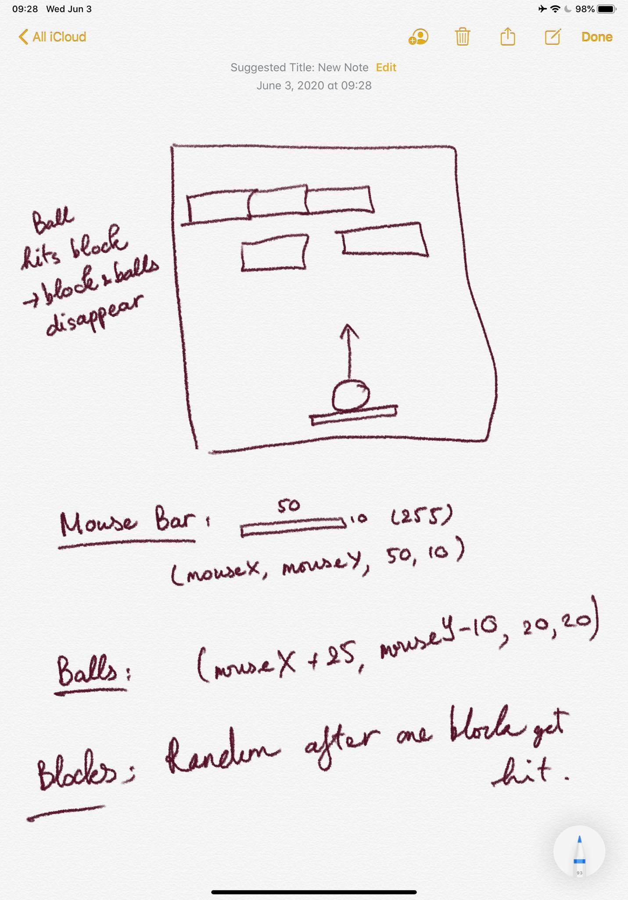

# Block Shooting Game

## Idea stage: 

- Drew the idea about what do I want to see on the screen for the game

- Simple draw the the game components in a straightfoward way 

## Complete stage: 

## Challenge: 

- Understanding "class" and use it 

- Coming up with the "reset" function to renew the the bullet and the block's position 

## Future Improvement: 

- Make it more colorful :))
